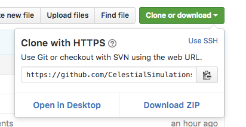
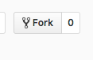
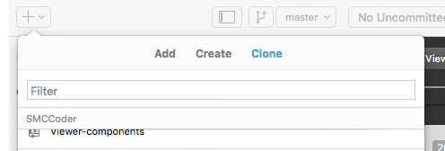

# The Relative Sizes of Planets Simulation

In this simulation, you will be able to add the missing planets of our solar system, and possibly
more! The universe has endless space, after all. To do this, you will be looking at *data*. Data is
a way for the computer to store massive amounts of values into a single *variable*, which means you
can select the data whenever you type the name of the variable. For example:

```
var somedata = ["apples", "oranges","pineapple"];
```
This is a type of variable, called an 'array', in which to store data. This is much more efficient than trying to use a bunch of variables,
like:

```
fruit1 = "apples";
fruit2 = "oranges";
fruit3 = "pineapple";
```
With data, you can loop through it, which becomes very efficient, compared to creating code for each variable, or in our case, each planet.

In order to access a value in data, you would use:

```
somedata[0];
```
This code would select the *first* value in somedata. The order in an array actually starts from 0, rather than 1.

In data, we can also use numbers, text(usually called strings), and _objects_. Objects are variables that can store multiple 'properties'. They look like this:

```
var human = {"name": "Tom", "height": 5.5, "coolness": "9/10", "favorite_movie": "Deadpool"}
```

If you wanted to get the human's coolness, you would use:

```
human.coolness
```

You can store multiple objects in array easily, so we could actually store the attributes of everyone in this class into a single variable.

In this simulation, I have created data for Earth. It looks like this:
```
var data = [{name: "Earth", mass: 5.97, diameter: 12756 }];
```
Mass is in units of 10²⁴ kilograms, and diameter is in units of kilometers.

Here are hints to finding the diameter of each planet.

| Name          | Radius     | Circumference | Surface Area  | Diameter      | Mass     |
| ------------- |:----------:|:-------------:|:-------------:|:-------------:| --------:|
| Sun           | <input/>   | 1392000π      | <input/>      | <input/>      | 1988500  |
| Mercury       | 2439.5     | <input/>      | <input/>      | <input/>      | 0.330    |
| Venus         | <input/>   | 38025.8       | <input/>      | <input/>      | 4.87     |
| Earth         | 6378       | 12756π        | 162715536π    | 12756         | 5.97     |
| Moon          | <input/>   | <input/>      | 12075625π     | <input/>      | 0.073    |
| Mars          | <input/>   | 6792π         | <input/>      | <input/>      | 0.642    |
| Jupiter       | <input/>   | <input/>      | 64228053049.5 | <input/>      | 1898     |
| Saturn        | <input/>   | 378675        | <input/>      | <input/>      | 568      |
| Uranus        | 25559      | <input/>      | <input/>      | <input/>      | 86.8     |
| Neptune       | <input/>   | <input/>      | 2453022784π   | <input/>      | 102      |
| Pluto         | <input/>   | 7445.6        | <input/>      | <input/>      | 0.0146   |

Remember:
- Diameter = 2 × r
- Circumference = 2 × π × r
- Surface Area = 4 × π × r²

It will be your job to to add the missing planets. After all, we wouldn't want our lovely planet Earth to be lonely now, would we? And what would be the point of looking at the simulations if there was nothing to compare planet Earth to? ;)

<style>
input {
  background-color: rgba(0,0,0, 0);
  border: none;
}
</style>
## Getting the Code

There are several ways to get the code for the simulation onto your computer:

1. [Cloning it](#cloning)
2. [Downloading it](#downloading)
3. [Forking and Cloning it](#forking-and-cloning)

### Cloning

If you choose to use git, then you'll first to want to open Terminal. Search Terminal on your computer
and open it. Type:

```
cd Documents
```
to navigate to the Documents folder within Terminal (it's just like the Finder). Then you'll want to
type in the following git commands.

```
git clone https://github.com/CelestialSimulations/Relative-Sizes-of-Planets.git
cd Relative-Sizes-of-Planets
git submodule init
git submodule update
```
After a few seconds, the folder should be ready! Open up Atom (you can just search for it on the computer),
and drag your folder to the Atom application. You should see all of the code.

### Downloading

Downloading it is fairly simple. However, there is a repository within this code, so you'll need to download
that as well. First, navigate to this button on this repository,



Click Dowload ZIP. Then navigate to the [inner repository](https://github.com/harmslab/Viewer-components), and download it as well. Expand the ZIPs, and move both folders to the Documents folder. Drag the contents of the
Viewer-components folder to the empty lib folder in the Relative-Sizes-of-Planets folder. The code should then
have what it needs in order to work. Open up Atom (you can just search for it on the computer),
and drag your folder to the Atom application. You should see all of the code.

### Forking and Cloning

In order to 'fork' a repository, which is to say, copy a version to it to your own account, you'll need to
create a Github account — and it's never too soon to try Github. Once you've done that, return to this repository, and click the Fork button.



Now open Github Desktop, click the plus icon, and select the Clone tab.



You should see your forked repository in the list. Click that, and click the button 'Clone Relative-Sizes-of-Planets'. Github Desktop will ask where you want your file, and you'll be able to
place it and name it. It should promptly start cloning the repository, and you will find it in the
location where you chose it to be. Open up Atom (you can just search for it on the computer),
and drag your folder to the Atom application. You should see all of the code.

## Opening it in the Browser

I'm sure you'll want to preview and see if the code appears to work. To do this, simply open the folder
in finder, and double click on index.html. It will automatically open in the browser.
